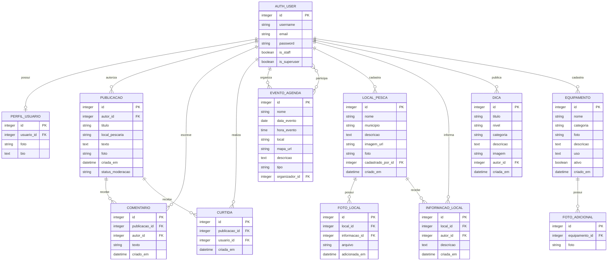

# Modelo entidade-relacionamento

```mermaid
erDiagram
    AUTH_USER ||--o| PERFIL_USUARIO : possui
    AUTH_USER ||--o{ PUBLICACAO : autoriza
    AUTH_USER ||--o{ COMENTARIO : escreve
    AUTH_USER ||--o{ CURTIDA : realiza
    AUTH_USER ||--o{ EVENTO_AGENDA : organiza
    AUTH_USER }o--o{ EVENTO_AGENDA : participa
    AUTH_USER ||--o{ LOCAL_PESCA : cadastra
    AUTH_USER ||--o{ INFORMACAO_LOCAL : informa
    AUTH_USER ||--o{ DICA : publica
    AUTH_USER ||--o{ EQUIPAMENTO : cadastra

    PUBLICACAO ||--o{ COMENTARIO : recebe
    PUBLICACAO ||--o{ CURTIDA : recebe
    LOCAL_PESCA ||--o{ FOTO_LOCAL : possui
    LOCAL_PESCA ||--o{ INFORMACAO_LOCAL : recebe
    EQUIPAMENTO ||--o{ FOTO_ADICIONAL : possui

    AUTH_USER {
        integer id PK
        string username
        string email
        string password
        boolean is_staff
        boolean is_superuser
    }
    PERFIL_USUARIO {
        integer id PK
        integer usuario_id FK
        string foto
        text bio
    }
    PUBLICACAO {
        integer id PK
        integer autor_id FK
        string titulo
        string local_pescaria
        text texto
        string foto
        datetime criada_em
        string status_moderacao
    }
    COMENTARIO {
        integer id PK
        integer publicacao_id FK
        integer autor_id FK
        string texto
        datetime criado_em
    }
    CURTIDA {
        integer id PK
        integer publicacao_id FK
        integer usuario_id FK
        datetime criada_em
    }
    EVENTO_AGENDA {
        integer id PK
        string nome
        date data_evento
        time hora_evento
        string local
        string mapa_url
        text descricao
        string tipo
        integer organizador_id FK
    }
    LOCAL_PESCA {
        integer id PK
        string nome
        string municipio
        text descricao
        string imagem_url
        string foto
        integer cadastrado_por_id FK
        datetime criado_em
    }
    FOTO_LOCAL {
        integer id PK
        integer local_id FK
        integer informacao_id FK
        string arquivo
        datetime adicionada_em
    }
    INFORMACAO_LOCAL {
        integer id PK
        integer local_id FK
        integer autor_id FK
        text descricao
        datetime criada_em
    }
    DICA {
        integer id PK
        string titulo
        string nivel
        string categoria
        text descricao
        string imagem
        integer autor_id FK
        datetime criada_em
    }
    EQUIPAMENTO {
        integer id PK
        string nome
        string categoria
        string foto
        text descricao
        text uso
        boolean ativo
        datetime criado_em
    }
    FOTO_ADICIONAL {
        integer id PK
        integer equipamento_id FK
        string foto
    }
```
